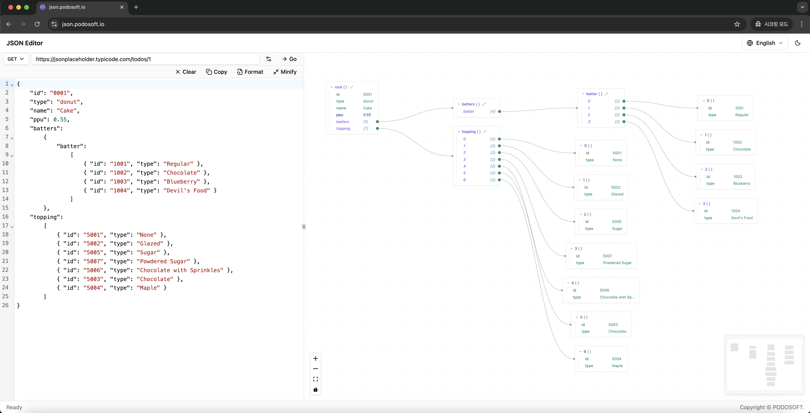

# PDJsonEditor

_[English](README.md)_

SvelteKit과 Svelte 5로 구축된 강력한 JSON 시각화 및 편집 도구입니다. JSON 데이터를 코드 에디터와 인터랙티브 그래프 뷰에서 동시에 보고 편집할 수 있습니다.

🔗 **[라이브 데모](https://json.podosoft.io)**



## ✨ 주요 기능

### 📝 고급 JSON 에디터

- **문법 강조**: CodeMirror 기반 JSON 문법 강조 기능
- **실시간 검증**: 즉시 JSON 문법 검증 및 오류 리포팅
- **포맷 & 압축**: 원클릭 JSON 포맷팅 및 압축 기능
- **네비게이션**: 그래프 노드 클릭으로 해당 JSON 위치로 이동

### 🔗 HTTP 요청 통합

- **다중 메소드 지원**: GET, POST, PUT, DELETE, PATCH 요청
- **커스텀 헤더**: HTTP 헤더 추가 및 관리
- **요청 본문**: POST/PUT/PATCH용 커스텀 요청 본문 설정
- **URL 가져오기**: URL에서 직접 JSON 데이터 가져오기

### 📊 인터랙티브 그래프 시각화

- **트리 구조**: JSON을 인터랙티브 트리 그래프로 시각화
- **컴팩트 노드**: 원시 값 그룹화 디스플레이
- **확장/축소**: 시각적 표시와 함께 노드 확장 토글
- **참조 네비게이션**: 관련 객체와 배열 간 네비게이션
- **자동 레이아웃**: Dagre 기반 자동 그래프 레이아웃

### 🎯 스마트 노드 디스플레이

- **그룹화된 원시 값**: 명확성을 위해 부모 노드에서 원시 값 그룹화
- **참조 타입**: 객체와 배열을 참조로 표시 (예: `address {3}`, `hobbies [3]`)
- **더 보기**: 20개 이상의 항목을 가진 노드를 "더 보기" 기능과 함께 자동 축소
- **개별 토글**: 개별 참조 항목 확장/축소

### 📑 다중 탭 지원

- **여러 문서**: 별도의 탭에서 여러 JSON 문서 작업
- **탭 관리**: 탭 생성, 이름 변경, 복제 및 닫기
- **가져오기/내보내기**: JSON 파일 가져오기 및 개별 탭 내보내기
- **키보드 단축키**: 
  - `Ctrl/Cmd + T`: 새 탭
  - `Ctrl/Cmd + W`: 현재 탭 닫기
  - `Ctrl/Cmd + Tab`: 다음 탭
  - `Ctrl/Cmd + Shift + Tab`: 이전 탭
  - `Ctrl/Cmd + 1-9`: 특정 탭으로 전환
- **자동 저장**: 탭이 localStorage에 자동 저장됨

### 🌐 다국어 지원

- **다중 언어**: 영어 및 한국어 지원
- **언어 전환기**: 헤더에서 쉬운 언어 전환
- **지속적 설정**: localStorage에 언어 설정 저장

## 🚀 시작하기

### 필수 조건

- Node.js v20.19 이상
- npm 또는 yarn 패키지 매니저

### 설치

1. **저장소 클론**

```bash
git clone https://github.com/podosoft-dev/pdjsoneditor.git
cd pdjsoneditor
```

2. **의존성 설치**

```bash
npm install
```

3. **개발 서버 시작**

```bash
npm run dev
```

4. **브라우저에서 열기**

```
http://localhost:5173
```

### 프로덕션용 빌드

```bash
# 애플리케이션 빌드
npm run build

# 빌드 미리보기
npm run preview
```

### Docker 배포

#### GitHub Container Registry의 사전 빌드된 이미지 사용

```bash
# 최신 이미지 가져오기
docker pull ghcr.io/podosoft-dev/pdjsoneditor:latest

# 컨테이너 실행
docker run -d -p 3000:3000 --name pdjsoneditor ghcr.io/podosoft-dev/pdjsoneditor:latest

# 컨테이너 중지
docker stop pdjsoneditor

# 컨테이너 제거
docker rm pdjsoneditor
```

#### 소스에서 빌드

```bash
# Docker 이미지 빌드
docker build -t pdjsoneditor .

# 컨테이너 실행
docker run -d -p 3000:3000 --name pdjsoneditor pdjsoneditor

# 컨테이너 중지
docker stop pdjsoneditor

# 컨테이너 제거
docker rm pdjsoneditor
```

#### Docker Compose 사용

```bash
# 빌드 및 컨테이너 시작
docker-compose up -d

# 로그 확인
docker-compose logs -f

# 컨테이너 중지
docker-compose down

# 재빌드 및 시작
docker-compose up -d --build
```

#### 사전 빌드된 이미지로 Docker Compose 사용

사전 빌드된 이미지를 사용하는 `docker-compose.yml` 생성:

```yaml
version: '3.8'

services:
  pdjsoneditor:
    image: ghcr.io/podosoft-dev/pdjsoneditor:latest
    container_name: pdjsoneditor
    ports:
      - '3000:3000'
    restart: unless-stopped
```

그 다음 실행:

```bash
docker-compose up -d
```

`http://localhost:3000`에서 애플리케이션 접속

## 📖 사용 방법

### 기본 JSON 편집

1. **JSON 붙여넣기 또는 입력**: 왼쪽 에디터 패널에서
2. **구조 보기**: 오른쪽 그래프 패널에서
3. **뷰 간 네비게이션**: 노드 클릭 또는 에디터 사용

### URL에서 데이터 가져오기

1. **HTTP 메소드 선택**: 드롭다운에서 (GET, POST, PUT, DELETE, PATCH)
2. **URL 입력**: 입력 필드에
3. **헤더와 본문 설정**: Settings 버튼 사용 (선택사항)
4. **"Go" 클릭**: JSON 데이터를 가져와서 로드

### 그래프 상호작용

- **확장/축소**: 노드의 색깔있는 핸들 클릭
- **더 보기**: 많은 항목이 있는 노드에서 "더 보기" 클릭
- **네비게이션**: 노드 클릭으로 해당 JSON 위치로 이동

## 🛠️ 기술 스택

- **프레임워크**: [SvelteKit](https://svelte.dev/docs/kit) with [Svelte 5](https://svelte.dev/)
- **스타일링**: [TailwindCSS v4](https://tailwindcss.com/)
- **UI 컴포넌트**: [shadcn-svelte](https://www.shadcn-svelte.com/)
- **JSON 에디터**: [CodeMirror](https://codemirror.net/)
- **그래프 시각화**: [@xyflow/svelte](https://xyflow.com/)
- **레이아웃 엔진**: [Dagre](https://github.com/dagrejs/dagre)
- **타입 안전성**: [TypeScript](https://www.typescriptlang.org/)
- **다국어 지원**: [typesafe-i18n](https://github.com/ivanhofer/typesafe-i18n)

## 📝 라이선스

이 프로젝트는 MIT 라이선스 하에 있습니다.

## 📞 지원

문제가 발생하거나 질문이 있으시면 GitHub에서 [이슈를 열어주세요](https://github.com/podosoft-dev/pdjsoneditor/issues).

---

<div align="center">
  <strong><a href="https://podosoft.io">PODOSOFT</a>에서 ❤️로 만들었습니다</strong>
</div>
