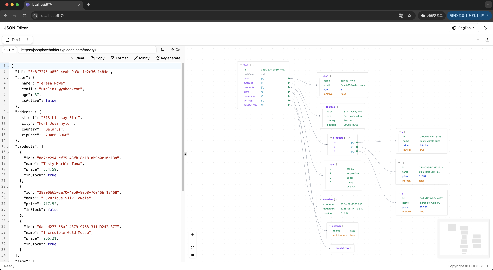

# PDJsonEditor

_[한국어](README-ko.md)_

A powerful JSON visualization and editing tool built with SvelteKit and Svelte 5. View and edit JSON data simultaneously in both code editor and interactive graph views.

🔗 **[Live Demo](https://json.podosoft.io)**



## ✨ Features

### 📝 Advanced JSON Editor

- **Syntax Highlighting**: CodeMirror-powered editor with JSON syntax highlighting
- **Real-time Validation**: Instant JSON syntax validation and error reporting
- **Format & Minify**: One-click JSON formatting and minification
- **Navigation**: Click on graph nodes to jump to corresponding JSON location

### 🔗 HTTP Request Integration

- **Multi-Method Support**: GET, POST, PUT, DELETE, PATCH requests
- **Custom Headers**: Add and manage HTTP headers
- **Request Body**: Configure custom request bodies for POST/PUT/PATCH
- **URL Import**: Fetch JSON data directly from URLs

### 📊 Interactive Graph Visualization

- **Tree Structure**: Visualize JSON as an interactive tree graph
- **Compact Nodes**: Compact display grouping primitive values
- **Expand/Collapse**: Toggle node expansion with visual indicators
- **Reference Navigation**: Navigate between related objects and arrays
- **Auto Layout**: Dagre-powered automatic graph layout

### 🎯 Smart Node Display

- **Grouped Primitives**: Primitive values grouped in parent nodes for clarity
- **Reference Types**: Objects and arrays shown as references (e.g., `address {3}`, `hobbies [3]`)
- **Show More**: Automatically collapse nodes with 20+ items with "show more" functionality
- **Individual Toggles**: Expand/collapse individual reference items

### 📑 Multi-Tab Support

- **Multiple Documents**: Work with multiple JSON documents in separate tabs
- **Tab Management**: Create, rename, duplicate, and close tabs
- **Import/Export**: Import JSON files and export individual tabs
- **Keyboard Shortcuts**:
  - `Ctrl/Cmd + T`: New tab
  - `Ctrl/Cmd + W`: Close current tab
  - `Ctrl/Cmd + Tab`: Next tab
  - `Ctrl/Cmd + Shift + Tab`: Previous tab
  - `Ctrl/Cmd + 1-9`: Switch to specific tab
- **Auto-save**: Tabs are automatically saved to localStorage

### 🌐 Internationalization

- **Multi-language**: English and Korean support
- **Language Switcher**: Easy language switching in header
- **Persistent Settings**: Language preference saved in localStorage

## 🚀 Getting Started

### Prerequisites

- Node.js v20.19 or higher
- npm or yarn package manager

### Installation

1. **Clone the repository**

```bash
git clone https://github.com/podosoft-dev/pdjsoneditor.git
cd pdjsoneditor
```

2. **Install dependencies**

```bash
npm install
```

3. **Start development server**

```bash
npm run dev
```

4. **Open in browser**

```
http://localhost:5173
```

### Building for Production

```bash
# Build the application
npm run build

# Preview the build
npm run preview
```

### Docker Deployment

#### Using Pre-built Image from GitHub Container Registry

```bash
# Pull the latest image
docker pull ghcr.io/podosoft-dev/pdjsoneditor:latest

# Run the container
docker run -d -p 3000:3000 --name pdjsoneditor ghcr.io/podosoft-dev/pdjsoneditor:latest

# Stop the container
docker stop pdjsoneditor

# Remove the container
docker rm pdjsoneditor
```

#### Building from Source

```bash
# Build Docker image
docker build -t pdjsoneditor .

# Run the container
docker run -d -p 3000:3000 --name pdjsoneditor pdjsoneditor

# Stop the container
docker stop pdjsoneditor

# Remove the container
docker rm pdjsoneditor
```

#### Using Docker Compose

```bash
# Build and start the container
docker-compose up -d

# View logs
docker-compose logs -f

# Stop the container
docker-compose down

# Rebuild and start
docker-compose up -d --build
```

#### Using Docker Compose with Pre-built Image

Create a `docker-compose.yml` with the pre-built image:

```yaml
version: '3.8'

services:
  pdjsoneditor:
    image: ghcr.io/podosoft-dev/pdjsoneditor:latest
    container_name: pdjsoneditor
    ports:
      - '3000:3000'
    restart: unless-stopped
```

Then run:

```bash
docker-compose up -d
```

Access the application at `http://localhost:3000`

## 📖 Usage

### Basic JSON Editing

1. **Paste or type JSON** in the left editor panel
2. **View the structure** in the right graph panel
3. **Navigate between views** by clicking nodes or using the editor

### Fetching Data from URLs

1. **Select HTTP method** from the dropdown (GET, POST, PUT, DELETE, PATCH)
2. **Enter the URL** in the input field
3. **Configure headers and body** using the Settings button (optional)
4. **Click "Go"** to fetch and load the JSON data

### Graph Interaction

- **Expand/Collapse**: Click the colored handles on nodes
- **Show More**: Click "Show more" on nodes with many items
- **Navigate**: Click nodes to jump to corresponding JSON location

## 🛠️ Tech Stack

- **Framework**: [SvelteKit](https://svelte.dev/docs/kit) with [Svelte 5](https://svelte.dev/)
- **Styling**: [TailwindCSS v4](https://tailwindcss.com/)
- **UI Components**: [shadcn-svelte](https://www.shadcn-svelte.com/)
- **JSON Editor**: [CodeMirror](https://codemirror.net/)
- **Graph Visualization**: [@xyflow/svelte](https://xyflow.com/)
- **Layout Engine**: [Dagre](https://github.com/dagrejs/dagre)
- **Type Safety**: [TypeScript](https://www.typescriptlang.org/)
- **Internationalization**: [typesafe-i18n](https://github.com/ivanhofer/typesafe-i18n)

## 📝 License

This project is licensed under the MIT License.

## 📞 Support

If you encounter any issues or have questions, please [open an issue](https://github.com/podosoft-dev/pdjsoneditor/issues) on GitHub.

---

<div align="center">
  <strong>Made with ❤️ by <a href="https://podosoft.io">PODOSOFT</a></strong>
</div>
